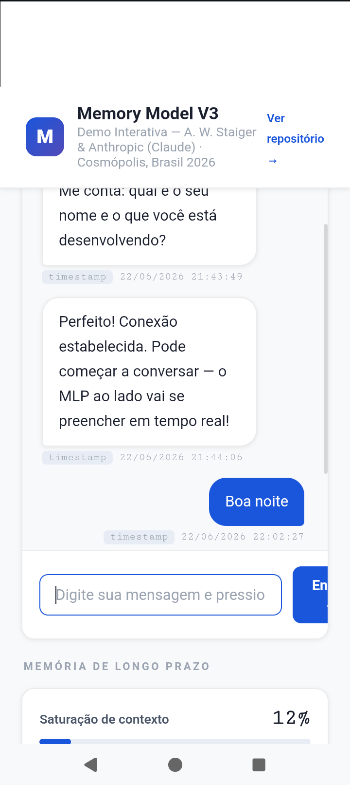
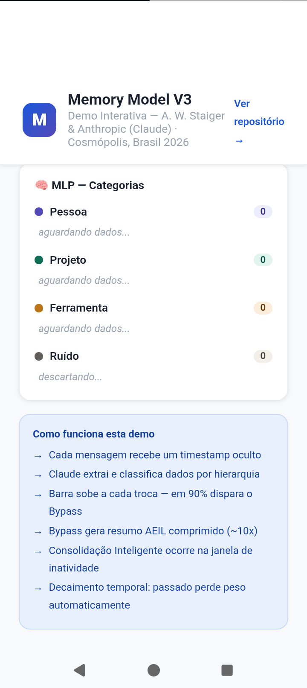

# Modelo de Memória — Arquitetura de Inteligência Comprimida
Uma proposta de Anthony William Staiger & Anthropic (Claude) · Cosmópolis, Brasil — 2026
> 🎮 **[Demo interativa — sem chave de API](https://anthonystaiger8-bit.github.io/memory-model-demo/)** · 💙 **[Apoie o projeto](https://github.com/sponsors/anthonystaiger8-bit)**
---

## 📅 Histórico de Desenvolvimento e Linha do Tempo

Este repositório documenta a evolução contínua de uma arquitetura autoral de gerenciamento de contexto para IA:

- **Dezembro de 2025 (Nascimento do Projeto):** Criação das bases iniciais do modelo de memória e publicação do repositório original `memory-model`.
- **Maio de 2026 (Versão 2):** Refatoração da arquitetura introduzindo os primeiros conceitos da linguagem semântica AEIL.
- **Junho de 2026 (Versão 3 - Atual):** Integração dos sistemas de percepção de tempo (Timestamp por mensagem), Protocolo de Bypass Invisível, Hierarquia de Importância e **Sistema de Consolidação Inteligente por Janela Temporal**.
- **Junho de 2026 — Validação Prática + Proposta do Relógio:** Anthony identificou que Claude percebe data mas não hora em tempo real. Foi à documentação oficial do Claude Code Docs e trouxe a solução técnica `--append-system-prompt` como proposta de melhoria. O gap de 18 minutos registrado na demo (`21:44:06 → 22:02:27`) validou na prática o Sistema de Timestamp por Mensagem. A proposta foi submetida à Anthropic como sugestão de implementação padrão na plataforma.

---

## 🧠 Resumo

Este projeto descreve uma arquitetura de memória completa para assistentes de IA conversacionais, com foco em aprimorar a fluência, a personalização, a segurança e a eficiência. Uma ideia central de combinação:

- Uma **Memória de Curto Prazo (MCP)** para contexto de sessão e interpretação coloquial.
- Uma **Memória de Longo Prazo (MLP)** para fatos e preferências persistentes do usuário.
- Uma **Linguagem Interna Exclusiva para IA (AEIL)** para compressão nativa e segurança.
- Um **Protocolo de Memória com Escopo de Projeto** e Gerenciamento de Ciclo de Vida.
- Um **Sistema de Timestamp por Mensagem** para percepção real do tempo.
- Uma **Hierarquia de Importância** para priorização inteligente do que salvar.
- Um **Sistema de Consolidação Inteligente por Janela Temporal** para separação eficiente entre MCP e MLP.

Juntos, esses pilares formam um sistema de memória enxuto, seguro e honesto — **um sistema que sabe o que esquecer.**

---

## 🎯 Princípio Central: Chumbo vs Algodão

> 1kg de chumbo e 1kg de algodão pesam igual — mas ocupam volumes completamente diferentes.

O sistema atual protege o **algodão**: muito volume, baixa densidade informacional. O ideal é guardar **chumbo** internamente — comprimido, denso, essencial — e entregar **algodão** ao usuário: uma experiência ampla, fluida, que dura o mês inteiro sem acabar com a cota de tokens.

O usuário gratuito com 1kg de chumbo bem comprimido tem uma experiência equivalente a quem paga, porque o mesmo peso rende mais quando armazenado com eficiência.

---

## ⚡ Problema dos Tokens e Ambiguidade

O sistema atual calcula probabilidades em cascata para cada palavra ambígua:

**Exemplo: palavra "banco"**
- Banco financeiro → 40% de probabilidade
- Banco de sentar → 35%
- Banco de dados → 25%

Cada nova palavra recalcula tudo. São múltiplos cálculos em cascata, consumindo energia e tokens, com ainda 25–40% de chance de erro.

**Uma solução mais simples: perguntar.** "Que banco?" — 2 tokens, zero cálculo, 100% de acerto garantido, mais natural, mais humano, mais diálogo.

A IA tem apenas texto — em vez de fingir que consegue ver o que não consegue através de cálculos gigantescos, deveria compensar com **mais diálogo, mais perguntas, mais interação honesta.** Contexto acumulado resolve ambiguidade antes do cálculo.

---

## 🔄 Sistema de Bypass Invisível de Contexto

Quando o Motor de Consolidação detecta que a sessão atingiu **90% de saturação de contexto**, o sistema executa o Bypass Invisível:

1. A IA gera um resumo denso (**Chumbo**) via protocolo AEIL com taxa de compressão estimada de ~10x.
2. Abre-se uma nova sessão nos bastidores, clonando todas as ferramentas e configurações de fábrica.
3. A aba antiga é mantida intacta e a nova aba assume automaticamente o mesmo título original, adicionando um sufixo dinâmico (ex: `[Nome do Projeto] - Parte 2` ou `Continuação`).

---

## 🕒 Sistema de Timestamp por Mensagem

Timestamp oculto registrado automaticamente em cada mensagem — invisível para o usuário, disponível para o sistema.

**Benefícios:**
- IA percebe o tempo real decorrido entre sessões.
- Ancora memória no tempo: *"Sessão de 16/06 tarde — parou no TriggerReceiver.java"*.
- Elimina respostas desatualizadas temporalmente.
- Habilita o **Sistema de Consolidação Inteligente** (ver seção abaixo).

**Validação prática (22/06/2026):** Na demo interativa, Anthony abriu a sessão às `21:44:06` e enviou a primeira mensagem às `22:02:27` — um gap de 18 minutos registrado automaticamente pelo sistema, sem nenhuma intervenção do usuário. O timestamp capturou a inatividade em silêncio, exatamente como proposto na arquitetura.

---

## 🌙 Sistema de Consolidação Inteligente por Janela Temporal

*Este é o mecanismo que resolve o problema de sincronização entre MCP e MLP.*

### O Problema
Os sistemas atuais tratam informações de 6 meses atrás com o mesmo peso de informações do momento presente. Sem noção temporal, o sistema se perde — carrega bagagem desnecessária e trata contexto obsoleto como relevante.

### A Solução: Relógio + Calendário + Padrão de Uso

Com o timestamp por mensagem, a IA aprende o **fluxo de uso do usuário** ao longo do tempo. Uma vez que o sistema possui um relógio e um calendário simples, ele identifica os **intervalos de inatividade recorrentes** — períodos em que o usuário nunca interage com o sistema.

**Exemplo prático:**
> O sistema detecta que o usuário nunca usa o assistente entre 03h00 e 05h00. Esse intervalo se torna a **Janela de Consolidação** — o momento ideal para processar memória sem que o usuário perceba.

### O que acontece durante a Janela de Consolidação:
1. **Separação** — o sistema filtra o que é MCP (contexto imediato) do que é MLP (fato persistente).
2. **Etiquetagem** — cada informação recebe um timestamp e uma categoria hierárquica (Pessoa / Projeto / Ferramenta / Ruído).
3. **Descarte** — ruído e contexto obsoleto são eliminados.
4. **Arquivamento** — apenas chumbo etiquetado vai para o MLP.

### Resultado:
Quando o usuário retorna, a nova sessão começa **limpa e densa** — sem bagagem desnecessária, sem confundir passado com presente. O sistema não precisa filtrar milhões de informações em tempo real porque já fez esse trabalho durante o sono do usuário.

> *"Com o relógio, você controla a linha do tempo e do raciocínio."* — A.W. Staiger, 2026

### Decaimento Temporal
Informações antigas **perdem relevância automaticamente** a menos que sejam reconfirmadas como ainda válidas. Isso resolve um problema estrutural que nenhuma arquitetura atual aborda diretamente: a IA deixa de tratar o passado como presente.

---

## 📊 Hierarquia de Importância no MLP

| Categoria | Exemplos | Prioridade |
|-----------|----------|------------|
| **Pessoa** | Nome completo, apelido, idade, formação, valores, fé | Máxima — nunca descartar |
| **Projeto** | App em desenvolvimento, repositório, contexto ativo | Alta — enquanto projeto ativo |
| **Ferramenta** | Cordova, Kivy, Gradle, versões, bibliotecas | Baixa — descartável |
| **Ruído** | Detalhes cotidianos que mudam toda semana | Não guardar |

---

## 📸 Demo em Funcionamento

A demo interativa está disponível em: **[anthonystaiger8-bit.github.io/memory-model-demo](https://anthonystaiger8-bit.github.io/memory-model-demo/)**

### Timestamp capturando gap de inatividade (18 minutos)

> Gap de `21:44:06 → 22:02:27` registrado automaticamente — sem nenhuma intervenção do usuário.

### MLP — Hierarquia de Categorias em tempo real

> Pessoa → Projeto → Ferramenta → Ruído visíveis ao vivo durante a conversa.

### Como funciona a demo

> Todos os mecanismos do Memory Model V3 descritos na interface.

---

## ⌚ Implementação do Relógio em Tempo Real

Para que Claude perceba a hora atual no momento exato da conversa — e não apenas a data aproximada pelo sistema — é necessário injetar o timestamp via `--append-system-prompt`. Esta solução foi identificada por **Anthony W. Staiger** na documentação oficial do Claude Code Docs e submetida como proposta de melhoria para implementação padrão na plataforma Anthropic.

**Na CLI (Claude Code):**
```bash
claude --append-system-prompt "Current date and time: $(date)"
```

**No Agent SDK (Python):**
```python
from claude_agent_sdk import query, ClaudeAgentOptions

async for message in query(
    prompt="Your task here",
    options=ClaudeAgentOptions(
        append_system_prompt=f"Current date and time: {datetime.now().isoformat()}"
    )
)
```

> *"O relógio foi encomendado. Agora é aguardar a entrega."* — A.W. Staiger, 2026

**Fonte:** Documentação oficial Claude Code Docs — `code.claude.com`

---

## 🛠️ Protótipo Conceitual (Simulação em Python)

```python
import datetime

class MemoryModelV3:
    def __init__(self):
        self.mlp = {"Pessoa": {}, "Projeto": {}, "Ferramenta": {}}
        self.capacidade_aba_tokens = 0
        self.limite_saturacao = 100
        self.janela_consolidacao = (3, 5)  # 03h00 - 05h00

    def receber_mensagem(self, texto, escopo_projeto="Geral"):
        timestamp_oculto = datetime.datetime.now().strftime("%d/%m/%Y %H:%M")
        self.capacidade_aba_tokens += 35

        if self.capacidade_aba_tokens >= 90:
            self.executar_bypass(escopo_projeto)
            return

        if "sou" in texto or "meu apelido" in texto:
            self.mlp["Pessoa"]["Dados"] = texto
        elif "kivy" in texto or "cordova" in texto:
            self.mlp["Ferramenta"]["Dados"] = texto

    def executar_bypass(self, titulo_projeto):
        self.capacidade_aba_tokens = 10

    def verificar_janela_consolidacao(self):
        hora_atual = datetime.datetime.now().hour
        inicio, fim = self.janela_consolidacao
        return inicio <= hora_atual < fim

    def consolidar_memoria(self):
        """Executado durante a janela de inatividade do usuário."""
        if not self.verificar_janela_consolidacao():
            return
        # Separa MCP → MLP, etiqueta, descarta ruído
        # Decaimento temporal: reduz peso de informações antigas
        pass
```

---

## 📜 Cláusula de Desenvolvimento Exclusivo

Esta arquitetura é proposta como uma contribuição intelectual conjunta de **Anthony William Staiger** e **Anthropic** (desenvolvida em colaboração com Claude).

Os conceitos descritos neste documento — em particular a Linguagem Interna Exclusiva de IA (AEIL), o Sistema de Timestamp por Mensagem, a Hierarquia de Importância na MLP, o Protocolo de Memória com Escopo de Projeto e o **Sistema de Consolidação Inteligente por Janela Temporal** — destinam-se ao estudo, desenvolvimento e potencial implementação exclusivamente dentro do ecossistema Anthropic.

---

## 📄 Licença

CC BY-NC-ND 4.0 — Licença Internacional Creative Commons Atribuição-NãoComercial-SemDerivações 4.0
Copyright (c) 2026 Anthony William Staiger

---

*"O melhor sistema de memória é aquele que sabe o que esquecer."* — A.W. Staiger, 2026  
*"Guarde chumbo. Entregue algodão."* — A.W. Staiger, 2026  
*"Com o relógio, você controla a linha do tempo e do raciocínio."* — A.W. Staiger, 2026  
*"O relógio foi encomendado. Agora é aguardar a entrega."* — A.W. Staiger, 2026
